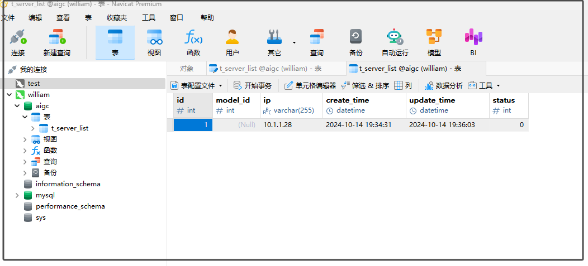

# MySQL

`作者：魏文应`  `时间: 2024-1014`

---

## 安装

```bash
docker pull mysql:latest
# 用户名：root 密码：root
docker run -itd --name "$USER"-mysql -p 3306:3306 -e MYSQL_ROOT_PASSWORD=root mysql
```

创建数据库 `aigc`，创建表`t_server_list`:




